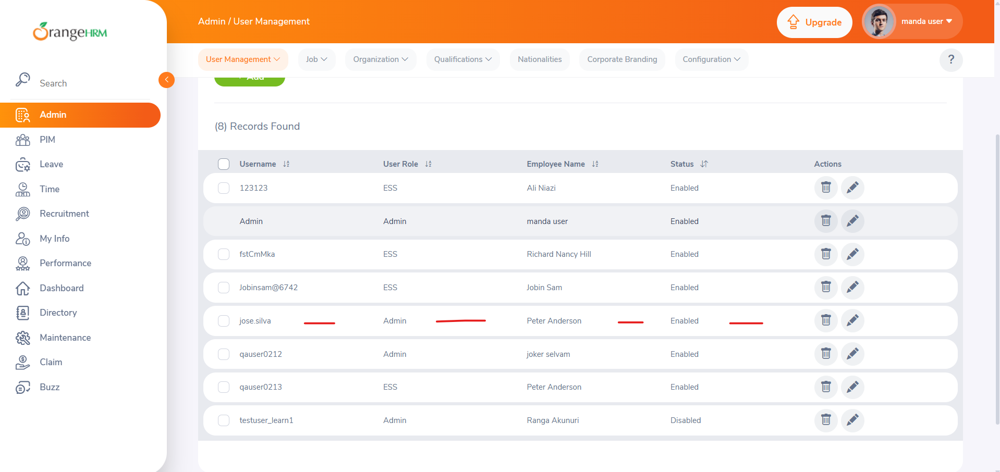
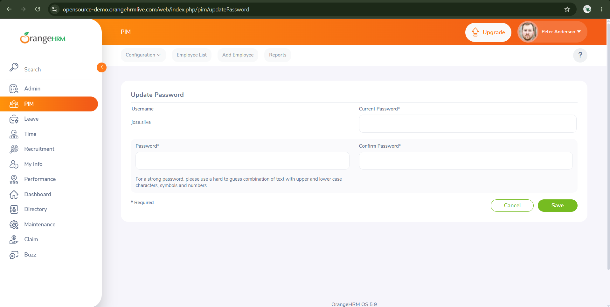
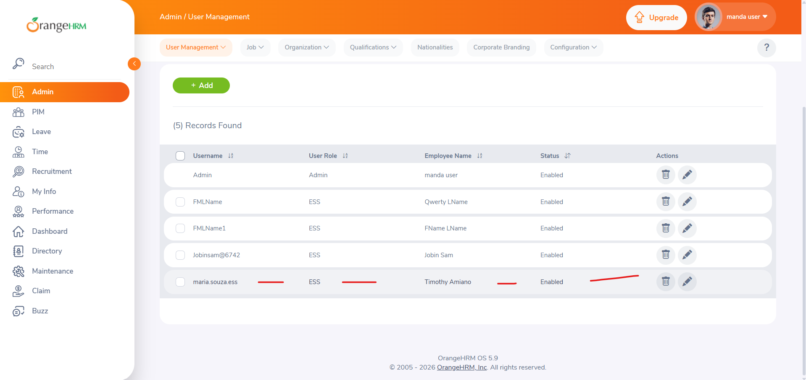
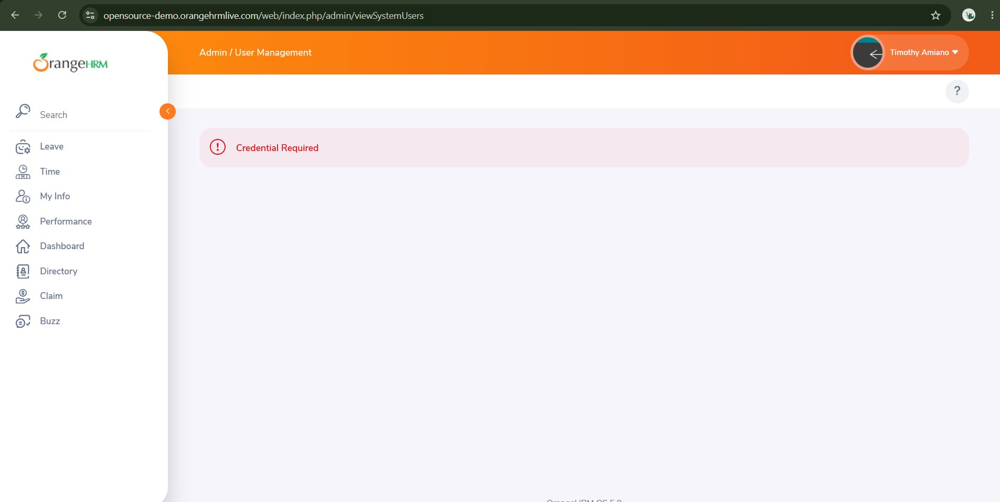

### TC_ADMIN_001 — Add a new admin user with valid data

**Precondition:** User logged in as Admin
**Priority:** High
**Type:** Functional

**Steps:**
1. Navigate to the "Admin" menu
2. Click "Add"
4. Select "User Role" = Admin
5. Link an existing "Employee Name"
6. Select "Status" = Enabled
7. Fill "Username" with "jose.silva"
8. Fill "Password" and "Confirm Password" with a valid password
9. Click "Save"

**Test data:**
- User Role: Admin
- Username: jose.silva
- Password: OrangeHRM1

**Expected Result:**
The system displays a "Successfully Saved" success message,
and the new user "jose.silva" appears listed on the
User Management screen with Role = Admin and Status = Enabled

---

**Execution Log**

| Date | Actual Result | Status | Evidence |
|---|---|---|---|
| 2026-08-22 | System showed success message and user appeared in the list as expected | ✅ Pass | 

---

### TC_ADMIN_002 — Verify that a user with Admin role can access the Admin section

**Precondition:** User "jose.silva" (Admin role) already created (TC_ADMIN_001 executed)
**Priority:** Highs
**Type:** Functional

**Steps:**
1. Log out of the current user
2. Log in with the user "jose.silva"
3. Fill in the password field with OrangeHRM1
4. Check the side menu

**Expected Result:**
The "Admin" menu is visible and accessible in the side menu,
allowing navigation to User Management

---

**Execution Log**

| Date | Actual Result | Status | Evidence |
|---|---|---|---|
| 2026-08-22 | The username jose.silva can access the admin section | ✅ Pass | 

-------

### TC_ADMIN_003 — Add a new system user with ESS role and valid data

**Precondition:** User logged in as Admin
**Priority:** High
**Type:** Functional

**Steps:**
1. Navigate to the "Admin" menu
2. Click "User Management" > "Users"
3. Click "Add"
4. Select "User Role" = ESS
5. Link an existing "Employee Name"
6. Select "Status" = Enabled
7. Fill "Username" with "maria.souza.ess"
8. Fill "Password" and "Confirm Password" with a valid password
9. Click "Save"

**Test data:**
- User Role: ESS
- Username: maria.souza.ess
- Password: Password@123

**Expected Result:**
The system displays a "Successfully Saved" success message,
and the new user "maria.souza.ess" appears listed on the
User Management screen with Role = ESS and Status = Enabled

**Execution Log**

| Date | Actual Result | Status | Evidence |
|---|---|---|---|
| | | | |
| 2026-08-22 | System showed success message and user appeared in the list as expected | ✅ Pass | 

--------------------------

### TC_ADMIN_004 — Verify that a user with ESS role (non-Admin) cannot access the Admin section

**Precondition:** Regular user (ESS role) created
**Priority:** High
**Type:** Negative

**Steps:**
1. Log in with a user that has the "ESS" role
2. Check the side menu

**Expected Result:**
The "Admin" menu is NOT visible in the side menu for this user

---

**Execution Log**

| Date | Actual Result | Status | Evidence |
|---|---|---|---|
| | | | |
| 2026-08-22 | The user cannot access the Admin section through the menu or directly via URL | ✅ Pass | 

